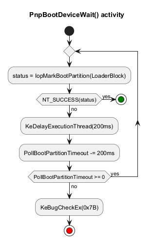

Debugging INACCESSIBLE_BOOT_DEVICE
===

On a singular case, the OS crashes with 
[code 0x7B](https://learn.microsoft.com/en-us/windows-hardware/drivers/debugger/bug-check-0x7b--inaccessible-boot-device)
in the presence of a PCIe adapter. The adapter is not mass storage, has no
capability to influence disk enumeration.

BSOD is issued early in the kernel startup, when `crashdmp.sys` is yet to be loaded.
For a *plan B*, the OS delivers a *minidump* through an UEFI capsule, if Bitlocker is
off. The firmware must recognize the capsule before writing the payload to the
*EFI System Partition*. This tight coupling is implemented through *Offline Crash Dump*
protocol <https://github.com/gmh5225/OfflineCrashDumpUefi>. The introduction is worthwhile.

`Microsoft-Windows-Kernel-Boot` ETW logs are inconsequential. `\Windows\bootstat.dat`
format is not documented, parsers are deprecated.

To observe the indicators around the crash, [this](https://github.com/armaber/drivers/tree/main/Review7B) 
driver plugs into `KeBugCheckEx` processing chain.

Analysis
---

The OS calls `IopMarkBootPartition` indirectly, from `IopInitializeBootDrivers`.

<details><summary>stack trace</summary>

```
    nt!IopWriteCapsuleTriageDumpToFirmware+0x80
    nt!IoWriteCrashDump+0x9a
    nt!KiBugCheckWriteCrashDump+0x51
    nt!KeBugCheck2+0xcba
    nt!KeBugCheckEx+0x107
    nt!PnpBootDeviceWait+0x172 (fptr = nt!IopMarkBootPartition)
    nt!IopInitializeBootDrivers+0x4b9
    nt!IoInitSystemPreDrivers+0xb15
    nt!IoInitSystem+0x15
    nt!Phase1Initialization+0x3b
    nt!PspSystemThreadStartup+0x55
```

</details>

<p align="center">
    
</p>

`PollBootPartitionTimeout` is set to 30 seconds in `HKLM\System\CurrentControlSet\Control\PnP`.

<details><summary>IopMarkBootPartition call tree</summary>

```
IopMarkBootPartition
│                   ZwOpenFile
├──────────────────▷PnpHardwareConfigCreateBootDriverFlags
│                                                         PipHardwareConfigOpenKey
│                                                         _RegRtlQueryValue
│                                                         ZwClose
│                                                         ZwCreateEvent
│                                                         ZwDeviceIoControlFile
│                                                         ZwWaitForSingleObject
│                                                         ExAllocatePool2
│                                                         ZwResetEvent
│                                                         SysCtxRegOpenKey
│                                                         RegRtlSetValue
│                                                         ExFreePool
├──────────────────▷IopAssignBootDriveLetter
│                                           RtlInitUnicodeString
│                                           IoGetDeviceObjectPointer
│                                           IopBuildDeviceIoControlRequest
│                                           IofCallDriver
│                                           ObfDereferenceObjectWithTag
│                                           KeWaitForSingleObject
└──────────────────▷IopStoreSystemPartitionInformation
                                                      RtlStringCchCopyW
                                                      ZwOpenSymbolicLinkObject
                                                      NtQuerySymbolicLinkObject
                                                      ObCloseHandle
                                                      IopOpenRegistryKeyEx
                                                      IopCreateRegistryKeyEx
                                                      NtSetValueKey
```

</details>

`ZwOpenFile` uses a path handed over by **winload.efi** as `LoaderBlock->ArcBootDeviceName`.
This is the likely candidate for failure. The BSOD's 1<sup>st</sup> parameter is the address
of the string, the 2<sup>nd</sup> is `NTSTATUS` code. Before `IopMarkBootPartition`,
disks are enumerated and partitions are discovered. For each partition, an
*Advanced RISC Computing* name is generated as a symbolic link.

Implementation
---

The driver is interposed in the BSOD chain, through 
[KeRegisterBugCheckCallback](https://learn.microsoft.com/en-us/windows-hardware/drivers/ddi/wdm/nf-wdm-keregisterbugcheckreasoncallback) API. Several stages can be handled, two of choice being:

- `KbCallbackTriageDumpData`, where the BSOD code and parameters are supplied
- `KbCallbackDumpIo`, where the *Memory.DMP* content is delivered one PAGE_SIZE at a time.

Usual high IRQL constrains apply: no memory allocation, no locking. In this case,
IRQL = PASSIVE_LEVEL allows deep queries.

Callback enumerates ARCs with `ZwQueryDirectoryObject` and identifies partition targets:

```text
\ArcName\multi(0)disk(0)rdisk(9)partition(2) C0000034
\??\SCSI#Disk&Ven_Patriot&Prod_Ignite#4&2da38729&0&000000#{53f56307-b6bf-11d0-94f2-00a0c91efb8b}
\ArcName\multi(0)disk(0)rdisk(0) -> \Device\Harddisk0\Partition0
\ArcName\multi(0)disk(0)rdisk(0)partition(1) -> \Device\Harddisk0\Partition1
\ArcName\multi(0)disk(0)rdisk(0)partition(2) -> \Device\Harddisk0\Partition2
\ArcName\multi(0)disk(0)rdisk(0)partition(3) -> \Device\Harddisk0\Partition3
\ArcName\multi(0)disk(0)rdisk(0)partition(4) -> \Device\Harddisk0\Partition4
\ArcName\multi(0)disk(0)rdisk(0)partition(5) -> \Device\Harddisk0\Partition5
\ArcName\multi(0)disk(0)rdisk(0)partition(6) -> \Device\Harddisk0\Partition6
\ArcName\multi(0)disk(0)rdisk(0)partition(7) -> \Device\Harddisk0\Partition7
\ArcName\multi(0)disk(0)rdisk(0)partition(8) -> \Device\Harddisk0\Partition8
```

The output is saved in a non-volatile EFI variable, retrieved in UserMode.

Notes
---

* `ZwSetValueKey` in the BSOD chain returns 0, has no effect after normal start.
* Use `.\SetupDriver.ps1` to start the driver at boot. `Review7B.exe` displays the EFI variables
used by OS and the custom variable.

```text
C:\> .\Review7B.exe
BugCheckProgress: 00 00 00 00
BugCheckCode: 00 00 00 00 FFFFFFEF 02 0F 00
BugCheckParameter1: 00 00 00 00 00 00 00 00
BugCheckParameter2 is not present
BugCheckParameter3 is not present
BugCheckParameter4 is not present
Review7B: 5C 41 72 63 4E 61 6D 65 5C 6D 75 6C 74 69 28 30 29 64 69 73 6B 28 30 29 72 64 69
73 6B 28 39 29 70 61 72 74 69 74 69 6F 6E 28 32 29 20 43 30 30 30 30 30 33 34 0A 5C 3F 3F
```

The custom variable is deleted with `/remove`. To convert the binary values:

```powershell
(((Get-Clipboard) -split "\s+" | foreach { [byte]"0x$PSItem" }) -as [char[]]) -join ""
```
