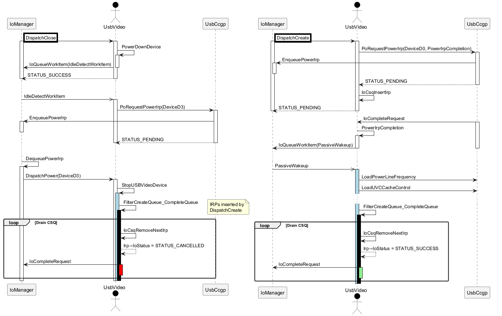

CreateFile(KSCATEGORY_VIDEO_CAMERA) fails with STATUS_CANCELLED
===

A developer reported an anomaly surfacing on a CreateFile/CloseHandle loop, using
`KSCATEGORY_VIDEO_CAMERA` interface. It was observed that *CreateFile* fails randomly
with `STATUS_CANCELLED`. The error does not replicate if a delay is placed before the
2<sup>nd</sup> *CreateFile* call.

```c
while (true) {
    HANDLE hFile = CreateFileW(deviceInterface, 0, 0, 0, OPEN_EXISTING, 0, 0);
    if (hFile != INVALID_HANDLE_VALUE) {
        CloseHandle(hFile);
    } else {
        printf("%u 0x%08X\n", i ++, RtlGetLastNtStatus());
    }
}
```

The problem replicates on *Windows 10* and *11* targets, as initially reported.

`usbvideo.sys` has its private symbols stripped. It is not possible to decode the WPP logs.
*Microsoft-Windows-USBVideo* provider yields no results.

Let's look at CreateFile/CloseHandle call graph in kernel mode. First, **IRP_MJ_CLOSE**:

```
$ImageFile = "C:\Windows\System32\drivers\usbvideo.sys";
& .\UfSymbol.ps1 -Image $ImageFile -Symbol usbvideo!USBVideoFilterClose -Down

usbvideo!USBVideoFilterClose [35]
│                           ⟜usbvideo!_imp_KsGetDevice
│                           ⟜usbvideo!_imp_KeWaitForSingleObject
│                           ⟜usbvideo!_imp_KeReleaseMutex
├──────────────────────────▷usbvideo!SetRegionOfInterestControlToDefaults
│                                                                        usbvideo!SubmitControlRequest
├──────────────────────────▷usbvideo!MSXURestoreDefaults
│                                                       usbvideo!IsSurfaceHubOS
│                           ⟜usbvideo!_imp_IoOpenDeviceRegistryKey
│                           ⟜usbvideo!_imp_RtlInitUnicodeString
│                           ⟜usbvideo!_imp_ZwSetValueKey
│                           ⟜usbvideo!_imp_ZwClose
└──────────────────────────▷usbvideo!PowerDownDevice
                                                    ⟜usbvideo!_imp_IoAcquireRemoveLockEx
                                                    ⟜usbvideo!_imp_KeAcquireSpinLockRaiseToDpc
                                                    ⟜usbvideo!_imp_IoAllocateWorkItem
                                                    ⟜usbvideo!_imp_IoQueueWorkItem
                                                    ⟜usbvideo!_imp_IoReleaseRemoveLockEx
                                                    ⟜usbvideo!_imp_KeReleaseSpinLock
```

`USBVideoFilterClose` calls *PowerDownDevice* which schedules a *work item*:

```
& .\UfSymbol.ps1 -Image $ImageFile -Display usbvideo!PowerDownDevice

usbvideo!PowerDownDevice+0xbe:
mov     rcx,qword ptr [rcx+18h]
call    qword ptr [usbvideo!_imp_IoAllocateWorkItem (00000001`c00442a8)]
nop     dword ptr [rax+rax]
lea     rdx,[usbvideo!IdleDetectWorkItem (00000001`c00095f0)]
test    rax,rax
je      usbvideo!PowerDownDevice+0x105 (00000001`c00097ed)

usbvideo!PowerDownDevice+0xda:
mov     r9,rbx
mov     qword ptr [rbx+0E8h],rax
mov     r8d,1
mov dword ptr [rbx+0D8h],1
mov     rcx,rax
call    qword ptr [usbvideo!_imp_IoQueueWorkItem (00000001`c0044250)]
```

`IdleDetectWorkItem` call graph:

```
usbvideo!IdleDetectWorkItem [8]
│                          ⟜usbvideo!_imp_KeAcquireSpinLockRaiseToDpc
│                          ⟜usbvideo!_imp_IoFreeWorkItem
│                          ⟜usbvideo!_imp_KeReleaseSpinLock
└─────────────────────────▷usbvideo!RequestDxPowerIrp
                                                     ⟜usbvideo!_imp_PoRequestPowerIrp
                           ⟜usbvideo!_imp_IoReleaseRemoveLockEx
```

**IRP_MJ_CREATE** call graph:

```
usbvideo!USBVideoFilterCreate [22]
│                            ⟜usbvideo!_imp_KsGetParent
│                            ⟜usbvideo!_imp_ExAllocatePoolWithTag
│                            ⟜usbvideo!_imp_KsAddItemToObjectBag
│                            ⟜usbvideo!_imp_ExFreePoolWithTag
│                            usbvideo!memset
├───────────────────────────▷usbvideo!PowerUpDevice
│                                                  ⟜usbvideo!_imp_KeAcquireSpinLockRaiseToDpc
│                                                  ⟜usbvideo!_imp_KeReleaseSpinLock
│                                                  usbvideo!RequestDxPowerIrp
│                            ⟜usbvideo!_imp_KsRemoveItemFromObjectBag
...
                             ⟜usbvideo!_imp_IoCsqInsertIrp
```

---

We can infer the following:

* IRP_MJ_CLOSE schedules a work item. The *IdleDetectWorkItem* powers down the device
*(IRP_MN_SET_POWER, PowerDeviceD3)*.
* IRP_MJ_CREATE powers up the device using *(IRP_MN_SET_POWER, PowerDeviceD0)*, adds the
IRP to a *cancel-safe queue*. `usbvideo!USBVideoFilterCreate` propagates *STATUS_PENDING*.

---

Let's establish where *IRP_MJ_CREATE* is completed. *PowerUpDevice* calls
*RequestDxPowerIrp*.

```
 usbvideo!RequestDxPowerIrp+0x42:
 lea     r9,[usbvideo!PowerIrpCompletion (00000001`c0006950)]
 ...
 call    qword ptr [usbvideo!_imp_PoRequestPowerIrp (00000001`c0045230)]
```

`PowerIrpCompletion` itself schedules a work item:

```
usbvideo!PowerIrpCompletion+0x1cf:
mov     r8d,1
mov     r9,rdi
call    qword ptr [usbvideo!_imp_IoQueueWorkItem (00000001`c0045278)]

usbvideo!PowerIrpCompletion+0x313:
mov     qword ptr [rdi+0F8h],rbx
lea     rdx,[usbvideo!PassiveWakeup (00000001`c00065c0)]
mov     rcx,rbx
jmp     usbvideo!PowerIrpCompletion+0x1cf (00000001`c0006b1f)
```

`PassiveWakeup` call stack:

```
usbvideo!PassiveWakeup [25]
│                     ⟜usbvideo!_imp_IoFreeWorkItem
├────────────────────▷usbvideo!LoadPowerLineFrequency
│                                                    usbvideo!GetDeviceRegValueDword
│                                                    ⟜usbvideo!_imp_KsAcquireDevice
│                                                    usbvideo!SubmitControlRequest
│                                                    ⟜usbvideo!_imp_KsReleaseDevice
├────────────────────▷usbvideo!LoadUVCCacheControl
│                                                 usbvideo!GetDeviceRegValueDword
│                                                 ⟜usbvideo!_imp_KsAcquireDevice
│                                                 usbvideo!SubmitControlRequest
│                                                 ⟜usbvideo!_imp_KsReleaseDevice
└────────────────────▷usbvideo!FilterCreateQueue_CompleteQueue
                                                              usbvideo!FilterCreateQueue_CompleteIrp
                                                              ⟜usbvideo!_imp_IoCsqRemoveNextIrp
                      ⟜usbvideo!_imp_IoReleaseRemoveLockEx
```

---

Where in the kernel is STATUS_CANCELLED set? An instruction like `mov eax,0C0000120h`
is implied. With an enhanced search criteria, 2 instances are revealed:
* `mov [rdi+30h],0C0000120h` representing *Irp&#x2192;IoStatus.Status*
* `mov edx,0C0000120h` is an argument to an internal function.

After several attempts, this stack trace shows the code path:

```
fffff807`79fbf61a ba200100c0      mov     edx,0C0000120h
fffff807`79fbf61f 488bcb          mov     rcx,rbx
fffff807`79fbf622 e831020000      call    usbvideo!FilterCreateQueue_CompleteQueue (fffff807`79fbf858)

0: kd> k

 # Child-SP          RetAddr               Call Site
00 ffff9104`4401f770 fffff807`79fbf627     usbvideo!FilterCreateQueue_CompleteQueue+0x1a
01 ffff9104`4401f7b0 fffff807`79f98b38     usbvideo!ExitIrpThreadAndQueue+0xc7
02 ffff9104`4401f7f0 fffff807`79f94bf3     usbvideo!StopUSBVideoDevice+0x44
03 ffff9104`4401f820 fffff807`7087b8a7     usbvideo!USBVideoSetPower+0x63
04 ffff9104`4401f860 fffff807`7087b09e     ks!CKsDevice::DispatchDeviceSetPowerIrp+0x35f
05 ffff9104`4401f8c0 fffff807`54da3787     ks!CKsDevice::DispatchPower+0x12e
06 ffff9104`4401f920 fffff807`54cac33d     nt!IopPoHandleIrp+0x3b
07 ffff9104`4401f950 fffff807`54da6c69     nt!IofCallDriver+0x6d
08 ffff9104`4401f990 fffff807`79ec157e     nt!IoCallDriver+0x9
09 ffff9104`4401f9c0 fffff807`79ec1133     ksthunk!CKernelFilterDevice::DispatchIrp+0x25e
0a ffff9104`4401fa20 fffff807`54db1477     ksthunk!CKernelFilterDevice::DispatchIrpBridge+0x13
0b ffff9104`4401fa50 fffff807`54c51425     nt!PopIrpWorker+0x207
0c ffff9104`4401faf0 fffff807`54e24504     nt!PspSystemThreadStartup+0x55
0d ffff9104`4401fb40 00000000`00000000     nt!KiStartSystemThread+0x34

0: kd> !irp @rax

Irp is active with 17 stacks 16 is current (= 0xffffc68925cea558)
 No Mdl: No System Buffer: Thread ffffc689271e7080:  Irp stack trace.
     cmd  flg cl Device   File     Completion-Context

>[IRP_MJ_CREATE(0), N/A(0)]
            0  1 ffffc6891e1813f0 ffffc68927f1c8c0 00000000-00000000    pending
	       \Driver\usbvideo
			Args: ffff9104460574d0 01000060 00000000 00000000
 [IRP_MJ_CREATE(0), N/A(0)]
            0  0 ffffc6891e1ced80 ffffc68927f1c8c0 00000000-00000000
	       \Driver\ksthunk
			Args: ffff9104460574d0 01000060 00000000 00000000
```

`StopUSBVideoDevice` call graph:

```
usbvideo!StopUSBVideoDevice [34]
├─────────────────────────▷usbvideo!ExitIrpThreadAndQueue
│                          │                             ⟜usbvideo!_imp_ExFreePoolWithTag
│                          │                             ⟜usbvideo!_imp_IofCompleteRequest
│                          │                             ⟜usbvideo!_imp_IoCsqRemoveNextIrp
│                          ├────────────────────────────▷usbvideo!FilterCreateQueue_CompleteQueue
│                          │                             ⟜usbvideo!_imp_KeReleaseSemaphore
...
│                                                        ⟜usbvideo!_imp_KeWaitForSingleObject
│                                                        ⟜usbvideo!_imp_ObfDereferenceObject
└─────────────────────────▷usbvideo!UnConfigureUSBVideoDevice
                           ├────────────────────────────────▷usbvideo!USBVideoCallUSBD
...
```

Conclusion
---
1. *USBVideoFilterCreate* powers up the device inband, adds the IRP to a CSQ, returns *STATUS_PENDING*:
    * *CompletionRoutine* schedules a *PassiveWakeup* work item.
    * *PassiveWakeup* sets up the [*power frequency*](https://learn.microsoft.com/en-us/windows-hardware/drivers/stream/ksproperty-videoprocamp-powerline-frequency)
or restores [*white balance*](https://learn.microsoft.com/en-us/windows-hardware/drivers/stream/camera-device-uvc-control-cache).
It drains the IRPs in the CSQ with *STATUS_SUCCESS*.
2. *USBVideoFilterClose* schedules a work item, IRP is resolved inband with *STATUS_SUCCESS*.
    * *IdleDetectWorkItem* powers down the device.
    * *StopUSBVideoDevice* calls *ExitIrpThreadAndQueue&#x2192;FilterCreateQueue_CompleteQueue(edx = 0xC0000120h)*
    * *FilterCreateQueue_CompleteQueue* drains the CSQ with *STATUS_CANCELLED*.

<details><summary>FilterCreateQueue_CompleteQueue drain loop</summary>

```asm
usbvideo!FilterCreateQueue_CompleteQueue+0x71:
mov     r8d,edi
mov     rdx,rbx
call    usbvideo!FilterCreateQueue_CompleteIrp

usbvideo!FilterCreateQueue_CompleteQueue+0x7c:
xor     edx,edx
mov     rcx,rsi
mov     r10,qword ptr [usbvideo!_imp_IoCsqRemoveNextIrp]
call    nt!IoCsqRemoveNextIrp
mov     rbx,rax
test    rax,rax
jne     usbvideo!FilterCreateQueue_CompleteQueue+0x1a Branch

usbvideo!FilterCreateQueue_CompleteQueue+0x95:
mov     rbx,qword ptr [rsp+40h]
mov     rsi,qword ptr [rsp+48h]
add     rsp,30h
pop     rdi
ret
```

</details>


