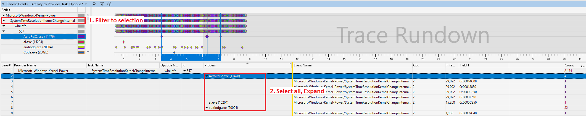

Timer Resolution on Windows, among Other Things
===
User reported a long time to complete for a tool. There is a code path that can impact the duration.

    void usleep(LONGLONG usec) {
        /* Convert to 100 nanosecond interval, negative value indicates relative time */
        ft.QuadPart = -(10 * usec);

        timer = CreateWaitableTimer(NULL, TRUE, NULL);
        SetWaitableTimer(timer, &ft, 0, NULL, NULL, 0);
        WaitForSingleObject(timer, INFINITE);
        CloseHandle(timer);
    }

Here, the implementation relies on a timer being triggered with &#x00B5;s resolution.

An overview of `usleep` calls during *.\microcontroller.exe* shows these results:

    PS C:\> $cdb = "${env:ProgramFiles(x86)}\Windows Kits\10\Debuggers\x64\cdb.exe";
    PS C:\> $commands = "bp kernel32!SetWaitableTimer "".symopt- 4; .printf \""SetWaitableTimer %N\"", dwo(@rdx); .echo; gc""; g; q";
    PS C:\> $output = & $cdb -c $commands .\microcontroller.exe
    PS C:\> $output | Where {$_ -like "SetWaitableTimer *"} | Foreach { [int]("0x"+($_ -split " 0{8,8}")[1])/-10} | Group | Select Count, Name | Sort Count -Descending
    Count Name     
    ----- ----     
      334 5000  
      329 130000
      273 120000
       10 10000 
        4 1000  
        1 200   

With **cdb.exe**, a breakpoint is placed on `SetWaitableTimer` and the 2nd argument is printed. The output is parsed, value divided by -10 to obtain the original &#x00B5;s argument.

**329** calls for usleep of **130 ms** are made. `usleep(130000)` can be located in the source.

Many arguments are a multiple of 1 millisecond. The OS clock runs on a multiple of ms as well, so the deviation is small.
On a hot-path containing `usleep(< 1000)`, the compound deviation expands substantially.

Experiment
---

On some platforms, the clock runs at 64 Hz, for a timespan of 156250 100-nanoseconds. Triggering a *WaitableTimer* after 5 milliseconds is done at clock boundary.

    #pragma comment(lib, "ntdll.lib")
    __declspec(dllimport) DWORD WINAPI NtSetTimerResolution(DWORD DesiredResolution,
                                                            BOOL SetResolution,
                                                            PDWORD CurrentResolution);
    #define SAMPLES 20
    #define INTERVAL 5000

    int main(int argc, char **argv)
    {
        double dfreq;
        LARGE_INTEGER freq, start, stop;
        LARGE_INTEGER ft;
        HANDLE timer;
        DWORD resolution;
        unsigned sample[SAMPLES], i;
        
        NtSetTimerResolution(0, FALSE, &resolution);
        printf("Computer tick resolution %u\n", resolution);
        
        QueryPerformanceFrequency(&freq);
        dfreq = (double)freq.QuadPart;
        dfreq = 1e+6 / dfreq;

        ft.QuadPart = -10LL * INTERVAL;
        for (i = 0; i < SAMPLES; i ++) {
            QueryPerformanceCounter(&start);
            timer = CreateWaitableTimer(NULL, TRUE, NULL);
                SetWaitableTimer(timer, &ft, 0, NULL, NULL, 0);
                WaitForSingleObject(timer, INFINITE);
            CloseHandle(timer);
            QueryPerformanceCounter(&stop);
            sample[i] = (unsigned)((stop.QuadPart - start.QuadPart) * dfreq);
        }

        for (i = 0; i < SAMPLES; i ++) {
            printf("%u\n", sample[i]);
        }

        return 0;
    }

Results on 3 different machines:

| MachineA, Windows Server 2019 | MachineB, Windows 10 Enterprise | MachineX, Windows 10 Home |
|---|---|---|
|     Computer tick resolution 19987 | Computer tick resolution 99997 | Computer tick resolution 10000 |
|     5681 |     11999 |     12967 |
|     6011 |     19825 |     16589 |
|     5996 |     10065 |     14375 |
|     5991 |     9844 |     16253 |
|     6017 |     10083 |     15594 |
|     6026 |     10029 |     16002 |
|     5962 |     9969 |     15965 |
|     6036 |     9991 |     16003 |
|     5967 |     16436 |     14992 |
|     6021 |     10041 |     15999 |
|     5963 |     19963 |     16011 |
|     6026 |     9994 |     17275 |
|     5970 |     20030 |     14379 |
|     6023 |     9986 |     14444 |
|     5966 |     19982 |     15875 |
|     6030 |     10027 |     14823 |
|     5959 |     19990 |     15360 |
|     6033 |     20020 |     16017 |
|     5961 |     16526 |     15244 |
|     6030 |     20005 |     15938 |

On **Windows Server** box, the results are stable, with the clock being fired every *2 ms*. The results are close to **2 ms x 3** period. On **Windows 10** box, many results are close to the *10 ms* boundary. **MachineX**, the development box running 10 Home shows large fluctuations. *What causes these?*

RE on NtSetTimerResolution
---

In the past, a microbenchmark jitter was reported from the field. Since it did not replicate in the lab, regression testing was done by increasing the clock frequency using this undocumented function.

Let's open a memory file and look at the implementation:

    0: kd> uf nt!NtSetTimerResolution
    ...
    fffff807`510f411d e8561c0000      call    nt!ExAcquireTimeRefreshLock (fffff807`510f5d78)
    fffff807`510f4122 8b3d40836000    mov     edi,dword ptr [nt!KeTimeIncrement (fffff807`516fc468)]
    ...
    fffff807`510f4191 e8f2000000      call    nt!PoTraceSystemTimerResolution (fffff807`510f4288)
    ...
    fffff807`510f41af e8847fc4ff      call    nt!ExpUpdateTimerResolution (fffff807`50d3c138)
    ...
    fffff807`510f41b6 488d0d63525200  lea     rcx,[nt!ExpTimeRefreshLock (fffff807`51619420)]
    fffff807`510f41bd e8fed2b2ff      call    nt!ExReleaseResourceLite (fffff807`50c214c0)
    fffff807`510f41c2 e8b9d2b2ff      call    nt!KeLeaveCriticalRegion (fffff807`50c21480)
    ...
    fffff807`510f422d e856000000      call    nt!PoTraceSystemTimerResolution (fffff807`510f4288)
    ...
    fffff807`510f4241 e8fe77c4ff      call    nt!ExpInsertTimerResolutionEntry (fffff807`50d3ba44)
    ...
    fffff807`510f424b e804d7ffff      call    nt!PoDiagCaptureUsermodeStack (fffff807`510f1954)
    ...
    fffff807`5122c1a3 e808af1800      call    nt!ExFreePool (fffff807`513b70b0)

Though the timer resolution is read in the experiment, **ExpTimerRefreshLock is acquired**. The call to **PoTraceSystemTimerResolution** indicates an [ETW](https://learn.microsoft.com/en-us/windows/win32/etw/event-tracing-portal) probe. We can use *xperf* or *Performance Recorder* to detect applications ending here.

The alternative shows many hits:

    PS C:\> (Get-Process | Where { $_.Modules.ModuleName -contains "ntdll.dll" }).Count
    190
    PS C:\> (Get-Process).Count
    367

Plan
---
- On stable systems, the *WaitableTimer* is triggered at resolution boundary. It does not have &#x00B5;s granularity.
- Implement and verify `usleep` as combination of `Sleep` and *CPU spin* for the remaining time. `Sleep` argument is a multiple of the resolution.
- Identify a lightweight replacement for `NtSetTimerResolution`.
- Determine which processes adjust the clock resolution.

NtQueryTimerResolution
---
Few **github** projects use this function next to `NtSetTimerResolution`. The declaration is:

    DWORD NtQueryTimerResolution(PDWORD MaximumResolution, PDWORD MinimumResolution, PDWORD CurrentResolution)

Disassembly shows only reads:

    0: kd> uf nt!NtQueryTimerResolution
    nt!NtQueryTimerResolution:
    ...
    fffff807`510deb35 8b05ddd86100    mov     eax,dword ptr [nt!KeMaximumIncrement (fffff807`516fc418)]
    fffff807`510deb3b 418903          mov     dword ptr [r11],eax
    fffff807`510deb3e 8b058cd96100    mov     eax,dword ptr [nt!KeMinimumIncrement (fffff807`516fc4d0)]
    fffff807`510deb44 8902            mov     dword ptr [rdx],eax
    fffff807`510deb46 8b051cd96100    mov     eax,dword ptr [nt!KeTimeIncrement (fffff807`516fc468)]
    fffff807`510deb4c 418902          mov     dword ptr [r10],eax
    ...
    nt!NtQueryTimerResolution+0x73:
    fffff807`510deb53 33c0            xor     eax,eax
    fffff807`510deb55 4883c418        add     rsp,18h
    fffff807`510deb59 c3              ret

Program modified with NtQueryTimerResolution:

    #include <windows.h>
    #include <stdlib.h>
    #include <stdio.h>

    #pragma comment(lib, "ntdll.lib")
    __declspec(dllimport) DWORD NTAPI NtQueryTimerResolution(PDWORD MaximumResolution,
                                                             PDWORD MinimumResolution,
                                                             PDWORD CurrentResolution);
    #define SAMPLES 20
    #define INTERVAL 5000

    static LONGLONG scale = 0;

    void get_frequency_scale(LONGLONG *value)
    {
        LARGE_INTEGER freq;

        QueryPerformanceFrequency(&freq);
        *value = freq.QuadPart;
    }

    void usleep(LONGLONG usec)
    {
        LARGE_INTEGER start, stop;
        DWORD resolution = 0, unused, ms = 0;
        LONGLONG count, barrier;
        
        QueryPerformanceCounter(&start);
        if (!scale) {
            get_frequency_scale(&scale);
        }
        NtQueryTimerResolution(&unused, &unused, &resolution);
        count = usec * 10 / resolution;
        if (count) {
            ms = (DWORD)((count * resolution) / 10000);
            Sleep(ms);
        }
        barrier = usec * scale;
        for (stop = start;
             (stop.QuadPart - start.QuadPart) * 1000000 < barrier;
             QueryPerformanceCounter(&stop)) ;

    }

    int main(int argc, char **argv)
    {
        double dfreq;
        LARGE_INTEGER freq, start, stop;
        DWORD resolution = 0, min, max;
        LONGLONG parm = INTERVAL;
        unsigned sample[SAMPLES], i;
        
        if (argc == 2) {
            parm = strtol(argv[1], NULL, 10);
        }
        NtQueryTimerResolution(&max, &min, &resolution);
        printf("Computer tick resolution min = %u, max = %u, current = %u\n",
            min, max, resolution);

        QueryPerformanceFrequency(&freq);
        dfreq = (double)freq.QuadPart;
        dfreq = 1e+6 / dfreq;

        for (i = 0; i < SAMPLES; i ++) {
            QueryPerformanceCounter(&start);
                usleep(parm);
            QueryPerformanceCounter(&stop);
            sample[i] = (unsigned)((stop.QuadPart - start.QuadPart) * dfreq);
        }

        for (i = 0; i < SAMPLES; i ++) {
            printf("%u\n", sample[i]);
        }

        return 0;
    }

| MachineA, Windows Server 2019 | MachineB, Windows 10 Enterprise | MachineX, Windows 10 Home |
|---|---|---|
| Computer tick resolution min = 5000, max = 156250, current = 19987 | Computer tick resolution min = 5000, max = 156250, current = 99999 | Computer tick resolution min = 5000, max = 156250, current = 10000 |
|     5000 |     5000 |    9325 |
|     5000 |     5000 |    17075 |
|     5000 |     5000 |    15407 |
|     5000 |     5000 |    19809 |
|     5000 |     5000 |    17359 |
|     5000 |     5000 |    22027 |
|     5000 |     5000 |    31062 |
|     5000 |     5000 |    16346 |
|     5000 |     5000 |    16157 |
|     5000 |     5000 |    14752 |
|     5000 |     5000 |    16598 |
|     5000 |     5000 |    19812 |
|     5000 |     5000 |    16671 |
|     5013 |     5000 |    15241 |
|     5000 |     5000 |    12040 |
|     5019 |     5000 |    17861 |
|     5000 |     5000 |    14060 |
|     5000 |     5000 |    16862 |
|     5000 |     5000 |    13101 |
|     5000 |     5000 |    15756 |

Let's enable *event tracing* on **MachineX**.

ETL Analysis
---

*Event Tracing for Windows* consists of event providers and consumers. The OS has many built-in providers.
- A provider has to be enabled to become part of the trace. 
- After the trace is stopped, the resulting **.etl** log file is analyzed.

Install the latest *Assesment and Deployment Kit*, as advised on [ETW Trace Processing Fails with Error Code 0x80070032
](https://devblogs.microsoft.com/performance-diagnostics/etw-trace-processing-fails-with-error-code-0x80070032/).

Launch *"C:\Program Files (x86)\Windows Kits\10\Windows Performance Toolkit\WPRUI.exe"*
and specify only **Power** in the *Resource Analysis* tree. Press *Start*, leave it for 10 seconds, *Stop*, *Save* and *Lauch WPA*.

On the *"Performance Analyzer"* GUI, look for *Generic Events*, expand *Microsoft-Windows-Kernel-Power*, select *SystemTimeResolutionKernelChangeInternal*, right click, *Filter to selection*.

To export the values in CSV, select all entries in the **Process** column and then right-click, *Expand*.

Once again, select all from *Line 2* to the end, `Ctrl+C` and paste into a CSV file.

    PS C:\> Get-Clipboard | Where { $_ -like "*SystemTimeResolutionKernelChangeInternal*" } | Foreach { ($_ -split ",")[9] } | Group | Select Count, @{ Name = "Resolution"; Expression = { [int]$_.Name } } | Sort Count -Descending

    Count Resolution
    ----- ----------
      268      40000
      255      50000
      228      85000
      223      80000
      177       5000
      170      10000
      132      45000
      129      90000
      120      20000
       76      35000
       75      30000
       69      55000
       66      15000
       50      65000
       36      60000
       34      25000
       32      70000
       20      75000
        9      95000
        5     100000

Within 10 seconds, out of **2174 calls** that modify the timer's resolution,  **177** request **500 &#x00B5;s** interval. Among those:
*Winword.exe, WindowsTerminal.exe, Thunderbird.exe, TeamViewer_Service.exe, System, pwsh.exe, PhoneExperienceHost.exe, MsMpEng.exe, msedge.exe, SuperDuperEdr.exe*.

The calls for a **10 ms** resolution belong to the *Idle* process.

Examples and Caveats
---
Let's look at *DbgX.Shell.exe* and  *SuperDuperEdr* applications. The debugger calls the function when user types in the command line.

    ModLoad: 00007ff6`4d400000 00007ff6`4d43a000   C:\Program Files\WindowsApps\Microsoft.WinDbg_1.2308.2002.0_x64__8wekyb3d8bbwe\DbgX.Shell.exe
    ModLoad: 00007ffc`d37d0000 00007ffc`d39c8000   C:\WINDOWS\SYSTEM32\ntdll.dll
    ModLoad: 00000186`e12b0000 00000186`e134c000   C:\Program Files\WindowsApps\Microsoft.WinDbg_1.2308.2002.0_x64__8wekyb3d8bbwe\DbgX.Shell.dll
    ModLoad: 00000186`df1e0000 00000186`df1ee000   C:\Program Files\WindowsApps\Microsoft.WinDbg_1.2308.2002.0_x64__8wekyb3d8bbwe\System.Runtime.dll
    
    0:022> bp ntdll!NtSetTimerResolution
    0:022> g
    Breakpoint 0 hit
    ntdll!NtSetTimerResolution:
    00007ffc`d3870600 4c8bd1          mov     r10,rcx
    0:005> r rcx
    rcx=0000000000002710
    0:005> r rdx
    rdx=0000000000000001
    0:005> k
    # Child-SP          RetAddr               Call Site
    00 00000002`4897f7a8 00007ffc`d2e1dd6d     ntdll!NtSetTimerResolution
    01 00000002`4897f7b0 00007ffc`61ba4d7b     KERNEL32!timeBeginPeriod+0xcd
    02 00000002`4897f7e0 00007ffc`61b94539     wpfgfx_cor3!CRenderTargetManager::EnableVBlankSync+0x5b [D:\a\_work\1\s\src\Microsoft.DotNet.Wpf\src\WpfGfx\core\uce\rendertargetmanager.cpp @ 967] 
    
In this case, the timer resolution is set to 1 ms using `timeBeginPeriod` WinAPI. From the [MSDN documentation](https://learn.microsoft.com/en-us/windows/win32/api/timeapi/nf-timeapi-timebeginperiod):

    Setting a higher resolution can improve the accuracy of time-out intervals in wait functions. However, it can also reduce overall system performance, because the thread scheduler switches tasks more often. High resolutions can also prevent the CPU power management system from entering power-saving modes. Setting a higher resolution does not improve the accuracy of the high-resolution performance counter.

*SuperDuperEdr.exe* makes heavy use of the *500 &#x00B5;s* timer. Based on *strings.exe* tool, the application is written in *Go*.

To extract the events from cli, specify an *XPath* query as an alternative to the **94 minutes** direct approach:

    PS C:\> (Get-Item $PathToEtl).Length/1Mb;
    357
    PS C:\> $SuperDuperEdr = 1948
    PS C:\> (Measure-Command { $a = Get-WinEvent -Path $PathToEtl -Oldest | Where { $_.Id -eq 557 -and $_.ProcessId -eq $SuperDuperEdr } | Select Message, TimeCreated }).TotalMinutes;
    94.3963127316667

The query must follow the XML tree, displayed like this:

    PS C:\> $xml = (Get-WinEvent $PathToEtl -Oldest | Select -First 1).ToXml()
    PS C:\> $xml.Replace(">",">`n").Replace("</", "`n</")
    <Event xmlns='http://schemas.microsoft.com/win/2004/08/events/event'>
    <System>
    <Provider Name='' Guid='{68fdd900-4a3e-11d1-84f4-0000f80464e3}'/>
    <EventID>
    0
    </EventID>
    ...
    <Keywords>
    0x0
    </Keywords>
    <TimeCreated SystemTime='2023-12-24T12:59:52.3688575Z'/>
    <EventRecordID>
    0
    </EventRecordID>
    <Correlation/>
    <Execution ProcessID='18668' ThreadID='2140'/>
    <Computer>
    MachineX
    </Computer>
    <Security/>

    </System>
    ...
    </Event>

Build the XPath:

    PS C:\> $Xpath = "*[System[Provider[@Name=""Microsoft-Windows-Kernel-Power""]][EventID=557][Execution[@ProcessID=$SuperDuperEdr]]]"

Launch the script:

    PS C:\>  (Measure-Command { $a = Get-WinEvent -Path $PathToEtl -Oldest -FilterXPath $Xpath }).TotalSeconds
    29.6164472
    PS C:\> $a | Select @{ Name = "Time"; Expression = {"{0:O}" -f $_.TimeCreated} }, @{ Name = "Resolution (100 ns)"; Expression = {$_.Properties.Value[0]} }

    Time                              Resolution (100 ns)
    ----                              -------------------
    2023-12-24T14:59:56.4388733+02:00              100000
    2023-12-24T14:59:57.0966059+02:00              100000
    2023-12-24T14:59:57.2186009+02:00                5000
    2023-12-24T14:59:57.2345282+02:00                5000
    2023-12-24T14:59:57.3138625+02:00                5000
    2023-12-24T14:59:57.7523386+02:00                5000
    2023-12-24T14:59:57.9709285+02:00                5000
    2023-12-24T14:59:58.5171669+02:00                5000
    2023-12-24T14:59:58.6266877+02:00                5000
    2023-12-24T14:59:58.6320063+02:00                5000
    2023-12-24T14:59:58.9546623+02:00                5000
    2023-12-24T14:59:59.7210099+02:00                5000
    2023-12-24T14:59:59.8321422+02:00                5000
    2023-12-24T14:59:59.9402520+02:00                5000
    2023-12-24T15:00:00.1586045+02:00                5000
    2023-12-24T15:00:00.3855294+02:00                5000
    2023-12-24T15:00:00.4877748+02:00              135000
    2023-12-24T15:00:00.8187415+02:00                5000
    2023-12-24T15:00:01.8028953+02:00                5000
    2023-12-24T15:00:02.0172844+02:00                5000
    2023-12-24T15:00:02.6731373+02:00               55000
    2023-12-24T15:00:03.3294125+02:00              100000
    2023-12-24T15:00:03.4387987+02:00              100000

Tracking Resolution Changes in Realtime
---

    PS C:\> Get-Content .\test.ps1
    # Sample interface to invoke native OS calls.
    # Based on https://blog.dantup.com/2013/10/easily-calling-windows-apis-from-powershell/
    # NtQueryTimerResolution is not documented.
    $script:nativeMethods = @();
    function Register-NativeMethod([string]$dll, [string]$methodSignature)
    {
        $script:nativeMethods += [PSCustomObject]@{ Dll = $dll; Signature = $methodSignature; }
    }

    function Add-NativeMethods()
    {
        $nativeMethodsCode = $script:nativeMethods | Foreach { "
            [DllImport(`"$($_.Dll)`")]
            public static extern $($_.Signature);
        " }
        Add-Type @"
            using System;
            using System.Runtime.InteropServices;
            public static class NativeMethods {
                $nativeMethodsCode
            }
    "@
    }

    Register-NativeMethod "ntdll.dll" "int NtQueryTimerResolution(ref Int32 Max, ref Int32 Min, ref Int32 Current)"
    Add-NativeMethods

    [int]$min = 0;
    [int]$max = 0;
    [int]$current = 0;
    $pmin = $min;
    $pmax = $max;
    $pcurrent = $current;

    while ($true) {
        [NativeMethods]::NtQueryTimerResolution([ref]$max, [ref]$min, [ref]$current) | Out-Null;
        if ($pmin -ne $min -or $pmax -ne $max -or $pcurrent -ne $current) {
            ("{0:O} frequency change $max, $min, $current" -f (Get-Date));
            $pmin = $min;
            $pmax = $max;
            $pcurrent = $current;
        }
    }

On **MachineX**, the frequency changes are shown:

    PS C:\> Set-ExecutionPolicy RemoteSigned -Scope Process -Force
    PS C:\> .\test.ps1
    2023-12-28T18:42:22.6786898+02:00 frequency change 156250, 5000, 10000
    2023-12-28T18:42:27.8752436+02:00 frequency change 156250, 5000, 5000
    2023-12-28T18:42:27.8760145+02:00 frequency change 156250, 5000, 10000
    2023-12-28T18:42:30.1759207+02:00 frequency change 156250, 5000, 5000
    2023-12-28T18:42:30.1766575+02:00 frequency change 156250, 5000, 10000
    2023-12-28T18:42:34.2445595+02:00 frequency change 156250, 5000, 5000
    2023-12-28T18:42:34.2453777+02:00 frequency change 156250, 5000, 10000
    2023-12-28T18:42:34.3532187+02:00 frequency change 156250, 5000, 5000
    2023-12-28T18:42:34.3539141+02:00 frequency change 156250, 5000, 10000
    2023-12-28T18:42:34.4629200+02:00 frequency change 156250, 5000, 5000
    2023-12-28T18:42:34.4638876+02:00 frequency change 156250, 5000, 10000
    2023-12-28T18:42:34.5746552+02:00 frequency change 156250, 5000, 5000
    2023-12-28T18:42:34.5769858+02:00 frequency change 156250, 5000, 10000
    2023-12-28T18:42:34.6853600+02:00 frequency change 156250, 5000, 5000
    2023-12-28T18:42:34.6861614+02:00 frequency change 156250, 5000, 10000

Lateral Exploration
---

A standalone tool that searches for a symbol, as in `mov     edi,dword ptr [nt!KeTimeIncrement]`, can be built in a 2-pass:
- disassemble the binary, either the current kernel or a memory file
- establish the function perimeter

The script divides the functions being disassembled on all but 1 cores, halving the time spent.

    PS C:\> (Measure-Command { $a = .\search-symbol.ps1 -Symbol KeTimeIncrement }).TotalMinutes; $a;
    57.755151805
    "C:\WINDOWS\System32\ntoskrnl.exe" has 17849 functions.
    Found 9 matches for KeTimeIncrement
    ntoskrnl!ExQueryTimerResolution, ntoskrnl!ExSetTimerResolution, ntoskrnl!KeClockInterruptNotify, ntoskrnl!KeGetClockTimerResolution, ntoskrnl!KiSetClockIntervalToMinimumRequested, ntoskrnl!NtSetTimerResolution, ntoskrnl!PoExecutePerfCheck
    PS C:\> del *.functions;
    PS C:\> (Measure-Command { .\search-symbol.ps1 -Symbol KeTimeIncrement -Single }).TotalMinutes;
    128.930202795

One of the matches:

    0:000> uf ntoskrnl!KeGetClockTimerResolution
    ntoskrnl!KeGetClockTimerResolution:
    00000001`40514180 8b05e2827e00    mov     eax,dword ptr [ntoskrnl!KeTimeIncrement (00000001`40cfc468)]
    00000001`40514186 8902            mov     dword ptr [rdx],eax
    00000001`40514188 8b05c2d37100    mov     eax,dword ptr [ntoskrnl!KiLastRequestedTimeIncrement (00000001`40c31550)]
    00000001`4051418e 8901            mov     dword ptr [rcx],eax
    00000001`40514190 c3              ret

A Google search for `KeGetClockTimerResolution` led to this [MSDN article](https://learn.microsoft.com/en-us/windows-hardware/drivers/kernel/high-resolution-timers).

    To avoid unnecessarily increasing power consumption, the operating system runs the system clock at its maximum rate only when necessary to satisfy the timing requirements of high-resolution timers. For example, if a high-resolution timer is periodic, and its period spans several default system clock ticks, the operating system might run the system clock at its maximum rate only in the part of the timer period that immediately precedes each expiration. For the rest of the timer period, the system clock runs at its default rate.

DRIVER_VERIFIER_DMA_VIOLATION 
---
In the absence of a stack trace, the script can reveal the callers and reconstruct the failure. On a separate root cause analysis, `IvtHandleInterrupt` raised [this](https://learn.microsoft.com/en-us/troubleshoot/windows-server/performance/stop-code-driver-verifier-dma-violation) **BSOD**:

    PS C:\> .\search-symbol.ps1 -Symbol ntoskrnl!IvtHandleInterrupt
    Found 51 matches for ntoskrnl!IvtHandleInterrupt
    ntoskrnl!HalpIvtProcessDrhdEntry, ntoskrnl!IvtHandleInterrupt
    PS C:\> .\search-symbol.ps1 -Symbol ntoskrnl!HalpIvtProcessDrhdEntry
    Found 114 matches for ntoskrnl!HalpIvtProcessDrhdEntrySymbol
    ntoskrnl!HalpIvtProcessDmarTable, ntoskrnl!HalpIvtProcessDrhdEntry

Conclusion
---
- *Thread Quantum* = *Timer Resolution* is adjusted by *Idle, SuperDuperEdr, MemCompression, MsMpEng, SearchIndexer, wermgr* and many other processes. **Idle, MemCompression, inbox anti-malware, wermgr** are active in every installation.
- The OS can split a sporadic timer request to fit best into CPU power states.
- `usleep` can work within boundary as a combination of native `Sleep` and `QueryPerformanceCounter`. In production, the OS runs a few applications, with a diminished probability for deviations.
- [timeBeginPeriod](https://learn.microsoft.com/en-us/windows/win32/api/timeapi/nf-timeapi-timebeginperiod) sets the resolution, [timeGetDevCaps](https://learn.microsoft.com/en-us/windows/win32/api/timeapi/nf-timeapi-timegetdevcaps) returns the *MinimumResolution, MaximumResolution*. The parameters are expressed in *milliseconds*.
- Applications are not meant to retrieve the current resolution, given the concurrent adjustment.
- Typical clock frequency is 100 Hz on Windows 10, 500 Hz on Windows Server.